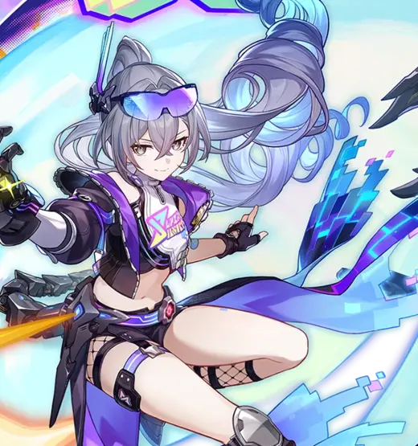
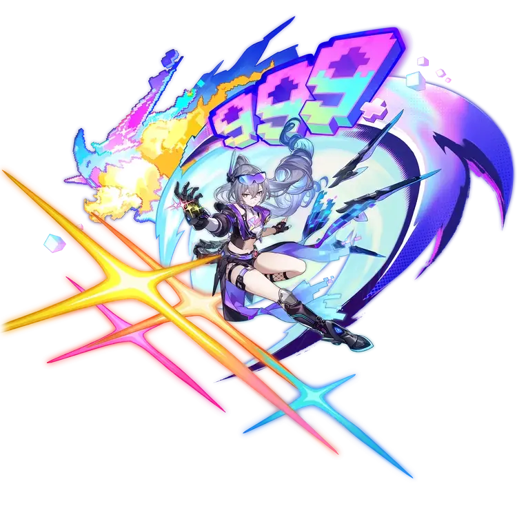
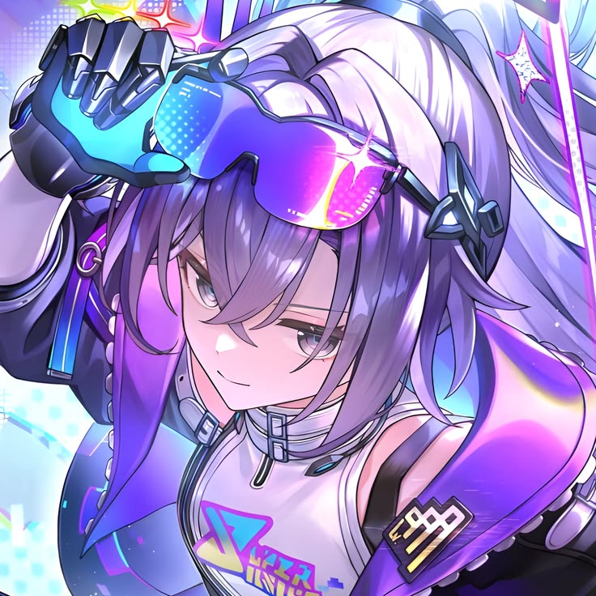
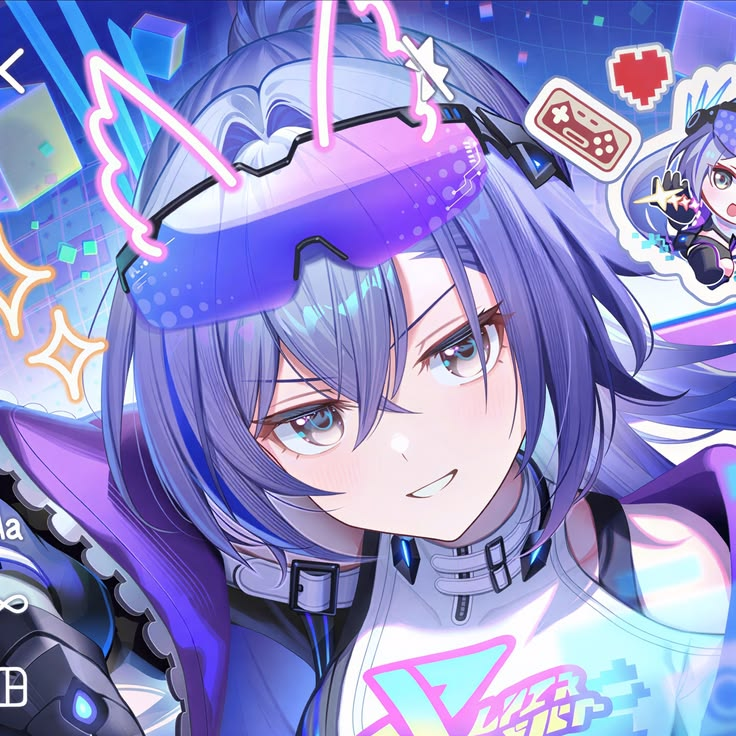

# 

<div>




<br/>

<br/><br/>

-  &nbsp;A young **Full-stack Developer** from Yugoslavia, evolving in the shadows
- 🎮 &nbsp;Into **Anime · Gaming · Strategy** — I treat code like a ranked match
- 💻 &nbsp;Quite skilled with &nbsp; TypeScript &nbsp; JavaScript &nbsp; [NodeJS](https://nodejs.org/) &nbsp; [Go](https://go.dev/)
- 🧩 &nbsp;Comfortable across &nbsp; React &nbsp; Next.js &nbsp; Laravel &nbsp; Symfony
- ⚡ &nbsp;Currently sharpening &nbsp; [Rust](https://rust-lang.org/) &nbsp; [Bun](https://bun.sh/) &nbsp; [Deno](https://deno.com/)

<br/>


<br clear="right"/>

<br/>





<br/>

- 💠 &nbsp;[***Clarity***](https://discord.gg/MGrZGTY2zY) <br/>
  &nbsp;&nbsp;&nbsp;&nbsp;My current focus — building in the shadows
- 🤝 &nbsp;[***iHorizon***](https://github.com/iHorizon) <br/>
  &nbsp;&nbsp;&nbsp;&nbsp;Contributor

<br/>


<br clear="right"/>

<br/>

<div align="center">


<br/>

<sub><i>"I stay in the shadows to shine brighter when it truly matters."</i></sub>

</div>

</div>

## Discord

<a href="https://discord.com/users/1072553881134972970">
  
</a>
<div align="right">

</div>


## My stats:

<p>


</p>

<p>

</p>


## Commits


## Connect with me

<a href="https://discord.gg/MGrZGTY2zY"></a>
<a href="https://guns.lol/tsubabadev"></a>
<a href="https://t.me/tsulinks"></a>
<a href="https://twitter.com/_1tsubasa"></a>

```yaml
discord:  1tsubasa
twitter:  @_1tsubasa
github:   mrtsubasa
```

## Thanks for reading ❤️


