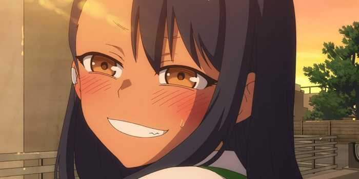
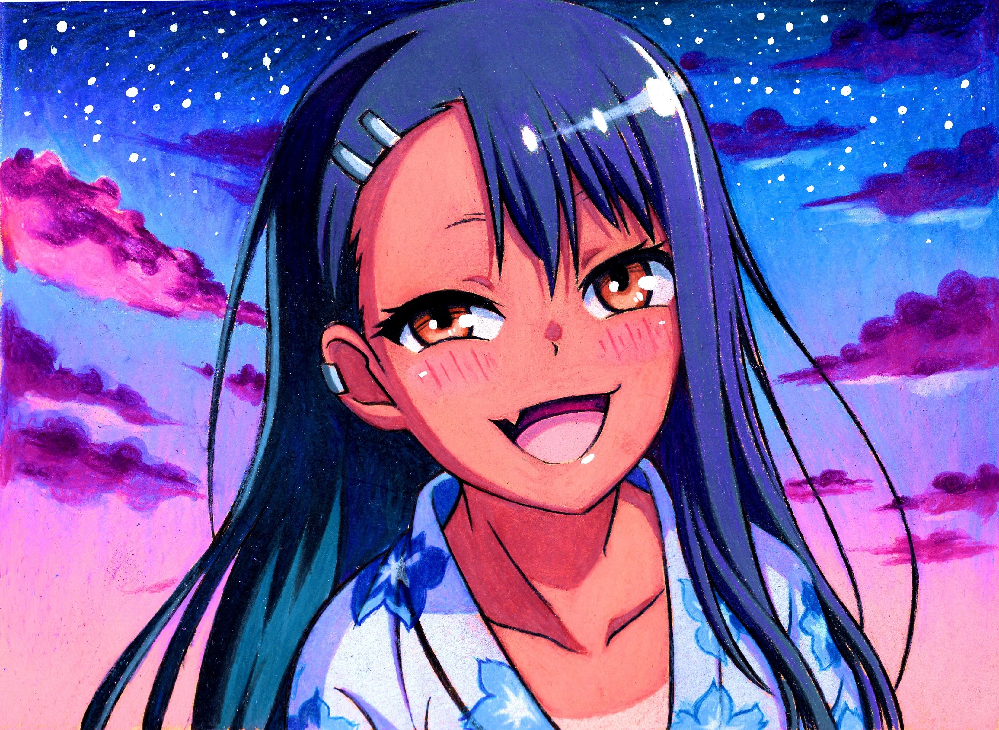

<div align="center">
  
  <p><i>Young Full-stack Developer from Yugoslavia</i></p>
  <p>In the shadows, I evolve. In the light, I ship.</p>
  
</div>

---

$\color{Tan}{Hi\ I\ am\ Tsubasa\ Welcome\ to\ my\ GitHub}$

---

## About Me

```yaml
location: 🇷🇸 Yugoslavia
profession: Full-stack Developer
age: 23
gender: Male
cosmos: Code, Strategy & Constant Evolution
combat_mode: Adaptive, Strategic, Passionate
quote: "I stay in the shadows to shine brighter when it truly matters."
```

---

## Projects

```yaml
actual:
  - Clarity
contributed:
  - iHorizon
```

<div align="center">
  
</div>

---

## Interests

```yaml
passion:
  - Anime
  - Gaming
  - Coding
  - Strategy
  - IT Interest
```

> "Every line of code is a cosmic punch toward perfection."
> "My true potential? No one has seen it at 100% yet."

---

## OS & Device

```yaml
os:
  - NixOS
  - macOS
  - CachyOS
  - Windows
device:
  laptop: MacBook Air 13 (M4, 2025)
  desktop:
    gpu: RTX 4060 Ti 16GB
    cpu: Ryzen 7 5700X (8-core)
    ram: 32GB DDR4 3200MHz
    storage:
      - 1TB SSD
      - 2TB HDD
```

---

## Stats

>$\color{Tan}{My \ Github \ Stats}$

<div align="center">
  
  
</div>

<div align="center">
  
</div>

<div align="center">
  

---

## 🛠️ Stack / Toolbox

<p align="center">
  
</p>

---

## My Team

```text
Taheb • Kisakay • Xon • Dok • 7up • Mikky • Swammyy • Aku • Shining
```

---

## Contact Me

- [Boar Hat](https://discord.gg/7T7zqmp2kH)
- [Guns.lol](https://guns.lol/tsubabadev)
- [Telegram](https://t.me/tsulinks)

```yaml
networks:
  discord: 1tsubasa
  twitter: @_1tsubasa
  github: mrtsubasa
  snapchat: tsu.clarity
```

---

<p align="center">
  
</p>

---

<div align="center">
  
</div>
